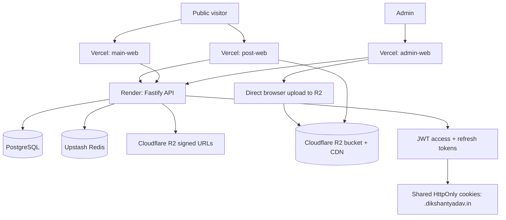

# post.dikshantyadav.in Architecture

Production blueprint for a dark-first developer publishing platform spanning public sites, admin publishing, shared SSO, API services, database, cache, media, SEO, analytics, and deployment.

## 1. Architecture Diagram



## 2. Target Monorepo Structure

```txt
apps/
  main-web/
    src/
      app/
      features/auth/
      routes/
      lib/api-client.ts
      lib/seo.ts
    public/
    vite.config.ts
  post-web/
    src/
      app/
      pages/home/
      pages/post/
      pages/search/
      features/posts/
      features/newsletter/
      components/post-card.tsx
      components/post-mdx.tsx
      components/reading-progress.tsx
      components/table-of-contents.tsx
      lib/mdx.ts
      lib/seo.ts
      stores/ui-store.ts
    public/
      robots.txt
    vite.config.ts
  admin-web/
    src/
      app/
      layouts/admin-layout.tsx
      pages/dashboard/
      pages/posts/
      pages/categories/
      pages/tags/
      pages/media/
      pages/analytics/
      pages/settings/
      features/editor/
      features/media-uploader/
      features/auth/
      components/data-table/
      components/stat-card.tsx
      stores/editor-store.ts
    vite.config.ts
  api/
    src/
      server.ts
      app.ts
      config/env.ts
      plugins/
        prisma.ts
        redis.ts
        auth.ts
        cors.ts
        rate-limit.ts
      modules/
        auth/
          auth.routes.ts
          auth.service.ts
          auth.schemas.ts
          token.service.ts
        posts/
          posts.routes.ts
          posts.service.ts
          posts.repository.ts
          posts.schemas.ts
        categories/
        tags/
        media/
        analytics/
        search/
        seo/
      middleware/
        require-admin.ts
        optional-auth.ts
      jobs/
        publish-scheduled-posts.ts
        refresh-sitemap.ts
      utils/
        slug.ts
        reading-time.ts
        mdx.ts
        cache-keys.ts
    package.json
packages/
  ui/
    src/
      button.tsx
      card.tsx
      input.tsx
      dialog.tsx
      command.tsx
      data-table.tsx
      post-card.tsx
      theme-provider.tsx
    tailwind.config.ts
  auth/
    src/
      cookies.ts
      jwt.ts
      guards.ts
      session.ts
  database/
    prisma/schema.prisma
    src/client.ts
  config/
    eslint/
    prettier/
    tailwind/
    tsconfig/
  shared/
    src/
      constants.ts
      seo.ts
      cache.ts
      errors.ts
  types/
    src/
      api.ts
      post.ts
      auth.ts
      media.ts
turbo.json
package.json
.github/workflows/ci-cd.yml
```

## 3. UI System

Design language: dark-first, fast, sharp, restrained, and premium. The interface should feel closer to Vercel dashboards and Linear workflows than a marketing blog.

Tokens:

```txt
background: #09090B
surface:    #18181B
border:     #27272A
accent:     #7C3AED
text:       #FAFAFA
muted:      #A1A1AA
success:    #22C55E
warning:    #F59E0B
danger:     #EF4444
```

Typography:

- Display: Geist
- Body: Inter
- Code/editor: IBM Plex Mono

Component rules:

- Use shadcn/ui primitives for forms, dialogs, menus, sheets, command palette, tabs, and data tables.
- Use Framer Motion only for meaningful transitions: card hover, route fade, command palette, post hero reveal.
- Keep cards at `rounded-lg` or lower. Avoid nested cards.
- Use icon buttons from lucide-react for admin actions.
- Use skeletons for homepage lists, post details, admin tables, media grid, and search results.

## 4. Public Frontend Architecture

`post-web` routes:

```txt
/                         Homepage
/posts                    All posts
/posts/:slug              Post detail
/category/:slug           Category archive
/tag/:slug                Tag archive
/search?q=                Global search
/rss.xml                  RSS feed
/sitemap.xml              Sitemap
/robots.txt               Robots
```

Homepage sections:

- Hero with heading: `Thoughts, Builds & Experiments`
- Subheading focused on engineering notes, product thinking, experiments, and systems.
- Global search bar with keyboard shortcut support.
- Featured posts grid.
- Recent posts list.
- Popular posts band.
- Tags section.
- Newsletter capture.
- Minimal footer.

Post card:

- Cover image with responsive `srcset`.
- Title, description, category, reading time, published date.
- Hover: border accent, subtle translate, image scale.
- Prefetch post detail on hover.

Post page:

- Top reading progress bar.
- Hero metadata, title, excerpt, category, tags.
- Cover image using responsive R2 variants.
- MDX renderer with syntax highlighting.
- Copy code button per code block.
- Sticky table of contents on desktop.
- Floating share button.
- Reactions.
- Related posts.
- Previous/next article navigation.

State:

- TanStack Query for server data and cache.
- Zustand for UI state: command palette, theme, editor draft state, upload queue.
- React Hook Form + Zod for all forms.

## 5. Admin Frontend Architecture

Admin routes:

```txt
/login
/dashboard
/posts
/posts/new
/posts/:id/edit
/categories
/tags
/media
/analytics
/settings
```

Admin features:

- Dashboard: total posts, drafts, scheduled posts, views, top posts, top tags.
- Posts: search, status filters, category/tag filters, pagination, bulk status changes.
- Editor: title, slug, excerpt, MDX/Markdown body, SEO fields, cover image, canonical URL, scheduled publish date.
- Categories/tags: create, edit, delete, sort by usage.
- Media library: upload, filter, copy CDN URL, view dimensions/blur placeholder.
- Analytics: page views, unique visitors, reactions, top posts, top categories.
- Settings: profile, site metadata, SEO defaults, newsletter provider keys.

Admin route protection:

- Initial load calls `GET /v1/auth/session`.
- If access token expired, API attempts refresh from HttpOnly refresh cookie.
- If refresh fails, redirect to `/login`.

## 6. Backend Architecture

Fastify plugins:

- `env`: Zod validated environment.
- `prisma`: singleton Prisma client.
- `redis`: Upstash Redis client.
- `auth`: JWT verify/sign helpers.
- `cors`: allow `https://dikshantyadav.in`, `https://post.dikshantyadav.in`, `https://work.dikshantyadav.in`, admin preview domains.
- `rate-limit`: stricter on auth and analytics endpoints.

Service boundaries:

- Routes validate input and shape responses.
- Services own business logic.
- Repositories own Prisma queries.
- Cache helpers isolate Redis keys and invalidation.
- Media module only signs uploads and stores metadata; it never proxies files.

## 7. Authentication Flow

Only `ADMIN` users exist. No registration endpoint.

Cookies:

```txt
access_token
  Domain=.dikshantyadav.in
  Path=/
  HttpOnly=true
  Secure=true
  SameSite=Lax
  MaxAge=15m

refresh_token
  Domain=.dikshantyadav.in
  Path=/v1/auth
  HttpOnly=true
  Secure=true
  SameSite=Lax
  MaxAge=30d
```

Login flow:

1. Admin submits email/password to `POST /v1/auth/login`.
2. API verifies password hash.
3. API creates a refresh token record hash in `users.refreshTokenHash`.
4. API returns admin profile and sets shared cookies for `.dikshantyadav.in`.
5. `main-web`, `post-web`, `work-web`, and `admin-web` all call `GET /v1/auth/session` and become authenticated from shared cookies.

Refresh flow:

1. Protected route checks `access_token`.
2. If missing/expired, middleware checks `refresh_token`.
3. If valid, rotate refresh token, issue new access token, update cookies.
4. If invalid, clear cookies and return 401.

Logout:

1. `POST /v1/auth/logout`.
2. Null refresh token hash in DB.
3. Clear both cookies on `.dikshantyadav.in`.

Security:

- Store refresh token hash, never raw token.
- Rotate refresh token on every refresh.
- Use bcrypt or argon2id for passwords.
- Enforce `ADMIN` role in middleware.
- Rate-limit login attempts.
- Add CSRF token for cookie-authenticated unsafe methods, or require `Authorization: Bearer` for admin mutations.
- Use strict CORS with credentials.
- Audit admin mutations.

## 8. Database Relations

Core relations:

- `users` 1:N `posts`
- `posts` 1:1 `post_contents`
- `categories` 1:N `posts`
- `posts` N:M `tags` through `post_tags`
- `users` 1:N `media`
- `posts` 1:N `views`
- `posts` 1:N `reactions`
- `posts` 1:N `bookmarks`

Status lifecycle:

```txt
DRAFT -> SCHEDULED -> PUBLISHED -> ARCHIVED
DRAFT -> PUBLISHED
PUBLISHED -> ARCHIVED
ARCHIVED -> DRAFT
```

## 9. API Specification

Base URL: `/v1`

### Auth

| Method | Route | Access | Request | Response |
| --- | --- | --- | --- | --- |
| POST | `/auth/login` | Public | `{ email, password }` | `{ user }` + cookies |
| POST | `/auth/refresh` | Cookie | none | `{ user }` + rotated cookies |
| POST | `/auth/logout` | Admin | none | `{ success: true }` |
| GET | `/auth/session` | Optional | none | `{ user: User | null }` |

### Posts

| Method | Route | Access | Request | Response |
| --- | --- | --- | --- | --- |
| GET | `/posts` | Public | query: `page, limit, status, category, tag, q` | `{ items, page, total }` |
| GET | `/posts/featured` | Public | none | `{ items }` |
| GET | `/posts/popular` | Public | query: `limit` | `{ items }` |
| GET | `/posts/:slug` | Public | none | `{ post }` |
| POST | `/posts` | Admin | `CreatePostInput` | `{ post }` |
| PATCH | `/posts/:id` | Admin | `UpdatePostInput` | `{ post }` |
| DELETE | `/posts/:id` | Admin | none | `{ success: true }` |
| POST | `/posts/:id/publish` | Admin | optional `{ publishedAt }` | `{ post }` |
| POST | `/posts/:id/archive` | Admin | none | `{ post }` |

CreatePostInput:

```json
{
  "title": "string",
  "slug": "string",
  "excerpt": "string",
  "content": "string",
  "contentFormat": "MDX",
  "categoryId": "uuid",
  "tagIds": ["uuid"],
  "status": "DRAFT",
  "featuredImageId": "uuid",
  "seoTitle": "string",
  "seoDescription": "string",
  "canonicalUrl": "string",
  "ogImageId": "uuid",
  "scheduledAt": "datetime"
}
```

### Categories

| Method | Route | Access | Request | Response |
| --- | --- | --- | --- | --- |
| GET | `/categories` | Public | none | `{ items }` |
| POST | `/categories` | Admin | `{ name, slug, description }` | `{ category }` |
| PATCH | `/categories/:id` | Admin | partial category | `{ category }` |
| DELETE | `/categories/:id` | Admin | none | `{ success: true }` |

### Tags

| Method | Route | Access | Request | Response |
| --- | --- | --- | --- | --- |
| GET | `/tags` | Public | none | `{ items }` |
| POST | `/tags` | Admin | `{ name, slug, description }` | `{ tag }` |
| PATCH | `/tags/:id` | Admin | partial tag | `{ tag }` |
| DELETE | `/tags/:id` | Admin | none | `{ success: true }` |

### Media

| Method | Route | Access | Request | Response |
| --- | --- | --- | --- | --- |
| GET | `/media` | Admin | query: `page, limit, type` | `{ items, page, total }` |
| POST | `/media/sign-upload` | Admin | `{ fileName, contentType, size }` | `{ uploadUrl, key, publicUrl, expiresAt }` |
| POST | `/media/complete` | Admin | `{ key, fileName, contentType, size, width, height, blurDataUrl }` | `{ media }` |
| DELETE | `/media/:id` | Admin | none | `{ success: true }` |

### Analytics

| Method | Route | Access | Request | Response |
| --- | --- | --- | --- | --- |
| POST | `/analytics/views` | Public | `{ postId, path, referrer }` | `{ success: true }` |
| GET | `/analytics/overview` | Admin | query: `from, to` | `{ totals, topPosts, topCategories }` |
| GET | `/analytics/posts/:id` | Admin | query: `from, to` | `{ views, uniques, reactions }` |

### Search

| Method | Route | Access | Request | Response |
| --- | --- | --- | --- | --- |
| GET | `/search` | Public | query: `q, category, tags, page, limit` | `{ items, facets, page, total }` |

## 10. Image Upload System

Flow:

1. Admin selects image.
2. Admin app calls `POST /v1/media/sign-upload`.
3. API validates size/type and creates an R2 presigned PUT URL.
4. Browser uploads directly to R2 with `PUT uploadUrl`.
5. Browser generates or requests blur placeholder metadata.
6. Admin app calls `POST /v1/media/complete`.
7. API stores metadata in `media`.
8. Public app renders via CDN URL and responsive variants.

Rules:

- Backend never receives raw image bytes.
- Limit MIME types to `image/jpeg`, `image/png`, `image/webp`, `image/avif`.
- Use deterministic keys: `media/yyyy/mm/{uuid}-{slug}.{ext}`.
- Generate variants through Cloudflare Image Resizing or a worker: 480, 768, 1200, 1600.
- Store width, height, blurDataUrl, dominantColor, alt text, and uploadedBy.

## 11. Search Architecture

Initial version:

- PostgreSQL full-text search with weighted vectors over title, excerpt, body text, category, and tags.
- Prisma raw query for ranking.
- Redis cache by normalized query.

Future version:

- Add Meilisearch, Typesense, or Postgres `pg_trgm` for typo tolerance.
- Keep API response contract stable.

Search index inputs:

- `posts.title`
- `posts.excerpt`
- `post_contents.plainText`
- `categories.name`
- `tags.name`

## 12. SEO Strategy

Required outputs:

- `sitemap.xml`: all published posts, categories, tags, home.
- `robots.txt`: allow public pages, disallow admin.
- Canonical URLs using `https://post.dikshantyadav.in/posts/:slug`.
- Open Graph title, description, image, type.
- Twitter card: `summary_large_image`.
- Article schema.org JSON-LD on post pages.
- RSS feed at `/rss.xml`.

Per-post SEO fields:

- `seoTitle`
- `seoDescription`
- `canonicalUrl`
- `ogImageId`
- `noIndex`

Sitemap invalidation:

- Rebuild cache when posts/categories/tags are published, archived, renamed, or deleted.

## 13. Analytics

Tracked metrics:

- Page views.
- Unique visitors using privacy-preserving hash of IP + user agent + daily salt.
- Top posts.
- Top categories.
- Reaction counts.

Implementation:

- Public app sends beacon to `POST /v1/analytics/views`.
- API stores raw view event with minimal metadata.
- Redis increments counters for fast dashboards.
- Nightly job can aggregate historical metrics into materialized summaries if needed.

Privacy:

- Do not store raw IPs.
- Hash visitor identifiers.
- Respect `Do Not Track` for optional analytics.

## 14. Redis Caching

Cache keys:

```txt
home:v1
posts:list:{hash}
posts:featured
posts:popular:{limit}
posts:detail:{slug}
search:{hash}
categories:list
tags:list
sitemap
rss
```

TTL:

- Homepage: 5 minutes.
- Popular posts: 10 minutes.
- Post detail: 30 minutes.
- Search results: 2 minutes.
- Sitemap/RSS: 1 hour with active invalidation.

Invalidation:

- Post create/update/delete: delete homepage, list, detail, search, sitemap, RSS, popular.
- Tag/category mutation: delete homepage, tags/categories, post lists, search, sitemap.
- View/reaction mutation: delete popular and affected post detail after debounce.

## 15. Performance Plan

Targets:

- Lighthouse 95+ performance, accessibility, best practices, SEO.
- TTFB under 300ms for cached pages.
- LCP under 2.5s on production mobile.

Tactics:

- Route-level code splitting with React Router lazy routes.
- TanStack Query prefetch on hover/viewport.
- Responsive R2 images and AVIF/WebP.
- Lazy-load below-fold images.
- Skeleton loaders for async sections.
- MDX code block component lazy-loaded.
- Cache homepage and post detail API responses.
- Precompute reading time, TOC, plain text, and SEO metadata at save time.
- Ship critical fonts with `font-display: swap`.

## 16. Backend Implementation Notes

Post save pipeline:

1. Validate input with Zod.
2. Normalize slug.
3. Compile MDX/Markdown for validation.
4. Extract headings into TOC JSON.
5. Extract plain text for search.
6. Calculate reading time.
7. Upsert post and content in transaction.
8. Update post-tag joins.
9. Invalidate Redis.

Scheduled publishing:

- Cron job every minute checks `status=SCHEDULED AND scheduledAt <= now()`.
- Transaction changes status to `PUBLISHED` and sets `publishedAt`.
- Invalidate public caches.

## 17. Deployment Workflow

Infrastructure:

- `main-web`, `post-web`, `admin-web`: Vercel projects.
- `api`: Render web service.
- PostgreSQL: managed Postgres.
- Redis: Upstash.
- Images: Cloudflare R2 + custom CDN domain.

Required env vars:

```txt
DATABASE_URL
DIRECT_URL
REDIS_URL
JWT_ACCESS_SECRET
JWT_REFRESH_SECRET
COOKIE_DOMAIN=.dikshantyadav.in
R2_ACCOUNT_ID
R2_ACCESS_KEY_ID
R2_SECRET_ACCESS_KEY
R2_BUCKET
R2_PUBLIC_BASE_URL
ADMIN_EMAIL
CORS_ORIGINS
```

## 18. Implementation Roadmap

Phase 1: Monorepo foundation

- Convert current Vite app into `apps/post-web`.
- Add Turborepo root package, workspace config, TypeScript, shared configs.
- Add `packages/ui`, `packages/types`, `packages/shared`, `packages/database`, `packages/auth`.

Phase 2: Backend core

- Create Fastify API.
- Add Prisma schema and migrations.
- Add auth plugin, cookies, refresh rotation, admin seed.
- Add posts/categories/tags CRUD.

Phase 3: Public publishing

- Build homepage, post listing, post detail, search pages.
- Add MDX rendering, syntax highlighting, TOC, progress bar, reactions.
- Add SEO metadata, sitemap, robots, RSS.

Phase 4: Admin dashboard

- Build protected admin shell.
- Add dashboard, posts table, editor, categories, tags.
- Add media library and signed R2 upload.

Phase 5: Analytics and caching

- Add view tracking.
- Add Redis cache wrappers and invalidation.
- Add popular posts and analytics dashboard.

Phase 6: Production hardening

- Add tests for auth, posts, media signing, cache invalidation.
- Add GitHub Actions.
- Add Vercel/Render deployment.
- Add observability, structured logs, rate limits, and backups.

