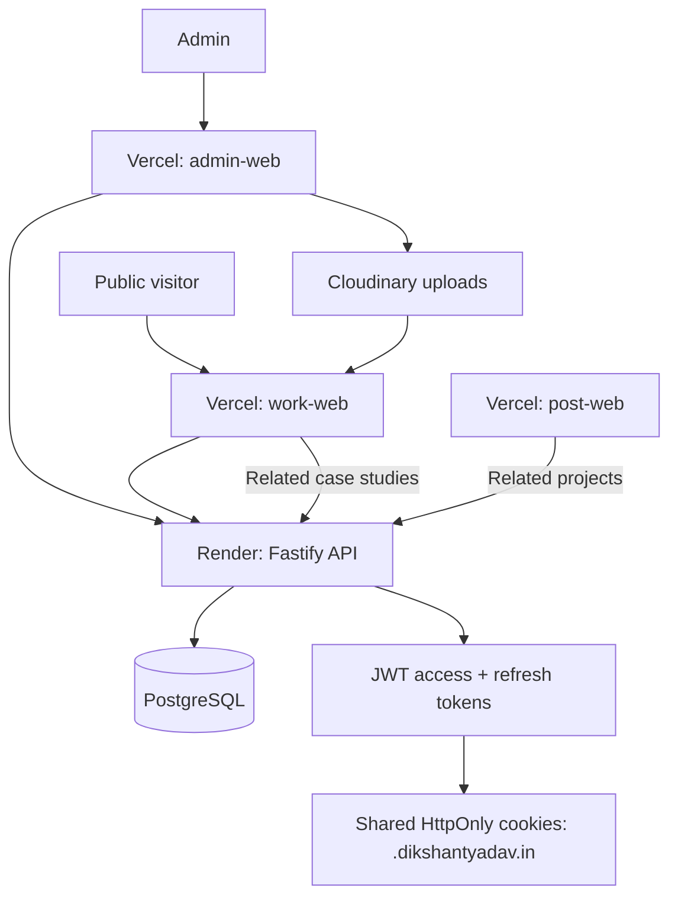

# Works Platform Architecture

The Works platform powers the portfolio site (`work.dikshantyadav.in`) and its
CMS. Case studies ("Works") are managed in the admin visual builder, stored as a
JSON canvas, served by the Fastify API, and rendered by the work-web site. Works
and posts are linked through a join table so case studies appear on the article
site and vice-versa.

## 1. Architecture Diagram



## 2. Domain Model

Work metadata lives on the `works` table. The page body is a JSON `canvas_data`
column holding typed nodes/edges; renderable blocks are derived from it.

```txt
works
  id, slug (unique), authorId, title, subtitle
  category, year, overview, description
  techStack (json), credits (json), link
  heroImageUrl, imageUrl, swatchColor
  status (WorkStatus: DRAFT | PUBLISHED | ARCHIVED)
  featured, featuredPinned, seoTitle, seoDescription, noIndex
  canvasData (json: { nodes, edges }), currentVersion
  publishedAt, archivedAt, createdAt, updatedAt

work_versions            (versioned canvas snapshots)
work_builder_nodes       (sync of canvas nodes, rebuilt on save)
work_builder_edges       (sync of canvas edges, rebuilt on save)
post_work_links          (postId, workId, sortOrder)  -- bidirectional links
```

## 3. Canvas Pipeline

Block types are defined once in `packages/node-registry` and reused by admin,
API, and public site. The exact names must match across every layer:
`large-image`, `grid-2`, `banner`, `posters`, `mobile-showcase`,
`desktop-showcase`, `bento`, `video`, `embed`, `metrics`, `link`.

```txt
node-registry (NodeDefinition + defaultData)
  -> admin WorkCanvas (nodes/edges in memory)
  -> PUT /works/:id/canvas  (work-builder.service.saveCanvas)
  -> works.canvas_data (json) + work_builder_nodes/edges + work_versions
  -> GET /works/:slug  (work.service derives contentBlocks via orderNodes)
  -> work-web ContentBlockRenderer (BlockBento, BlockVideo, ...)
```

`orderNodes` lives in `packages/shared` (re-exported by admin-web). The API
applies it to `canvasData` and returns a flat `contentBlocks` array alongside the
work detail.

## 4. API Surface

| Method | Route | Access | Purpose |
| --- | --- | --- | --- |
| GET | `/works` | Public | list (PUBLISHED only unless admin), paginated |
| GET | `/works/:slug` | Public | detail + `contentBlocks`, `prev`/`next`, `posts` |
| POST | `/works` | Admin | create work |
| PATCH | `/works/:id` | Admin | update metadata |
| DELETE | `/works/:id` | Admin | delete work |
| GET | `/works/:id/canvas` | Public | raw canvas |
| PUT | `/works/:id/canvas` | Admin | save canvas + version bump |
| GET | `/works/:id/versions` | Admin | version list |
| POST | `/works/:id/versions/:version/restore` | Admin | restore snapshot |
| GET | `/work-nodes` | Public | node registry (admin builder) |
| PUT | `/works/:id/posts` | Admin | replace linked posts for a work |
| GET | `/works/:id/posts` | Public | linked posts for a work |
| GET | `/posts/:id/works` | Public | linked works for a post |
| POST | `/upload` | Admin | multipart upload to Cloudinary |
| POST | `/upload/url` | Admin | register external URL |
| DELETE | `/upload/:id` | Admin | delete media |

`prev`/`next` neighbors are computed in the canonical public order
(`publishedAt desc, updatedAt desc`, PUBLISHED only; admin uses all statuses).
Each neighbor returns `{ slug, title, subtitle, imageUrl, heroImageUrl,
swatchColor }`.

## 5. work-web Rendering

- `lib/api.ts` — `getWorks()` / `getWork(slug)` server fetch helpers with
  `next: { revalidate: 60 }`; failures degrade to `[]` / `null` so `next build`
  succeeds without the API.
- `app/project/[slug]/page.tsx` — `generateStaticParams` from `getWorks()`;
  renders `CaseStudyPage` from the API detail.
- `CaseStudyPage` renders blocks through `ContentBlockRenderer` in `contentBlocks`
  order, then `CreditsSection`, then `RelatedCaseStudies` (linked posts →
  `post.dikshantyadav.in/posts/:id/:slug`), then `NextProjectSection`
  (API `prev`/`next`).
- Color system: `swatchColor` per work. `useAccentColor` uses it, falling back to
  a client-side dominant color extracted from the hero image. `ColorTracker`
  follows the pointer with a mix-blend dot tinted by the accent.

## 6. post-web Related Projects

- `lib/posts.ts` → `getLinkedWorks(postId, limit)` calls `GET /posts/:id/works`
  (ISR tag `works`).
- Article page renders a Suspense-wrapped `RelatedProjects` grid linking to
  `work.dikshantyadav.in/project/:slug`.

## 7. Uploads: Dedup + Size Limits

- `services/upload.service.ts` — `findDuplicateUpload(fileName, contentType,
  size)` matches `fileName.toLowerCase() + contentType + size` and short-circuits
  to the existing record (`deduplicated: true`) before Cloudinary. A
  `findUnique({ key })` guard stays as a second net.
- `UPLOAD_LIMITS`: image 5 MB, video 100 MB, pdf 25 MB, enforced server-side in
  `routes/upload.ts` (per MIME kind) and mirrored client-side in
  `admin-web MediaField` before any request is made.
- `app.ts` raises the multipart `fileSize` cap to 100 MB so video fits.

## 8. Seed Script

- `apps/api/src/scripts/seed-works.ts` (run via `npm run seed:works`) upserts the
  6 legacy static projects (luxury-watch-brand, bespoke-luxury-porsche, naggys,
  pinegold-ira, loris-academy, lightwaves) as PUBLISHED works.
- `contentBlocks` and the legacy `bento` metadata become canvas nodes
  (bento first, then content blocks in order) with `currentVersion: 1`.
- Idempotent: upsert keyed on `slug`; re-running updates in place.
- `publishedAt` values descend in the original list order so prev/next ordering
  matches the legacy site. Bootstraps the default admin if none exists.

## 9. CI / Deploy

- Root `build` includes `@dikshant/work-web` (`next build`); root `lint` and
  `seed:works` are available.
- `.github/workflows/ci-cd.yml` deploy job curls
  `VERCEL_WORK_WEB_DEPLOY_HOOK` alongside the other frontend hooks.
- work-web is SSG + ISR: `/` and `/sitemap.xml` revalidate every 60s;
  `/project/[slug]` is statically generated from the API.
